## **PROJECT 2**

### **STEP 0: Preparing Prerequisites**

Setting up an AWS server and a virtual server with the ubuntu server OS
sign in to AWS free tier account and create a new EC2 Instance of t2.micro family with Ubuntu Server 2o.04 LTS (HVM) image .

Prerequisites

1. Make yourself familiar with basic [SQL syntax](https://www.w3schools.com/sql/sql_syntax.asp) and [commonly used commands](https://www.w3schools.com/sql/sql_syntax.asp).

2. Be comfortable using not only VIM, but also Link [Nano editor](https://www.nano-editor.org) as well, get to know basic Nano commands.

### **STEP 1: Installing the Nginx Web Server**

`sudo apt update`

`sudo apt install nginx`

`sudo systemctl status nginx`

`curl http://localhost:80`

running these command on the terminal gives:

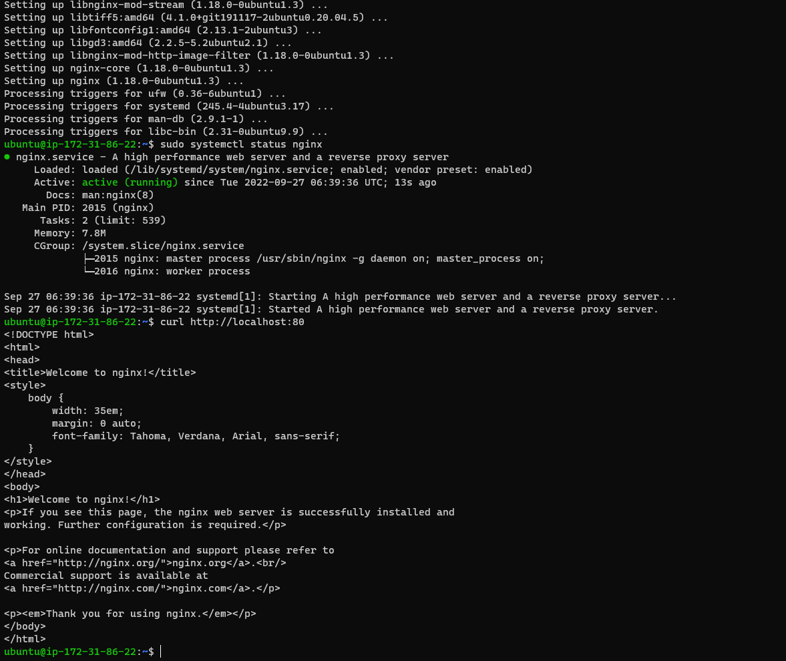

result:

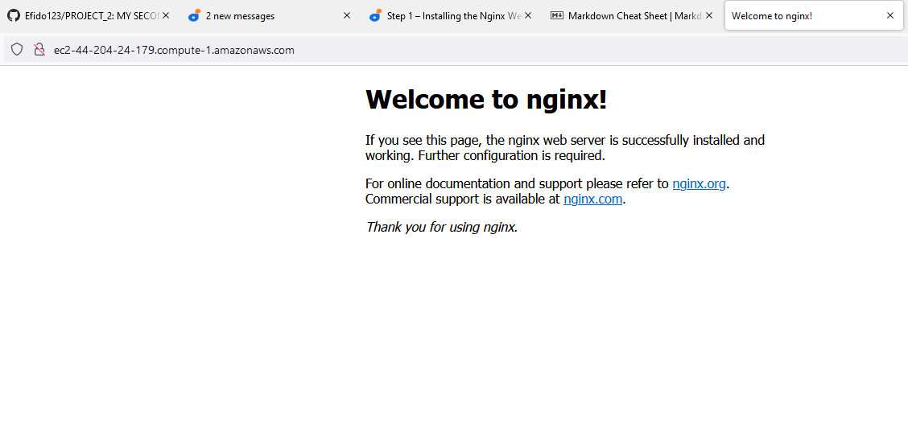

### **STEP 2: Installing MYSQL**

`sudo apt install mysql-server`

`sudo mysql`

`sudo mysql_secure_installation`

`sudo mysql -p`

`Mysql> Exit`

result

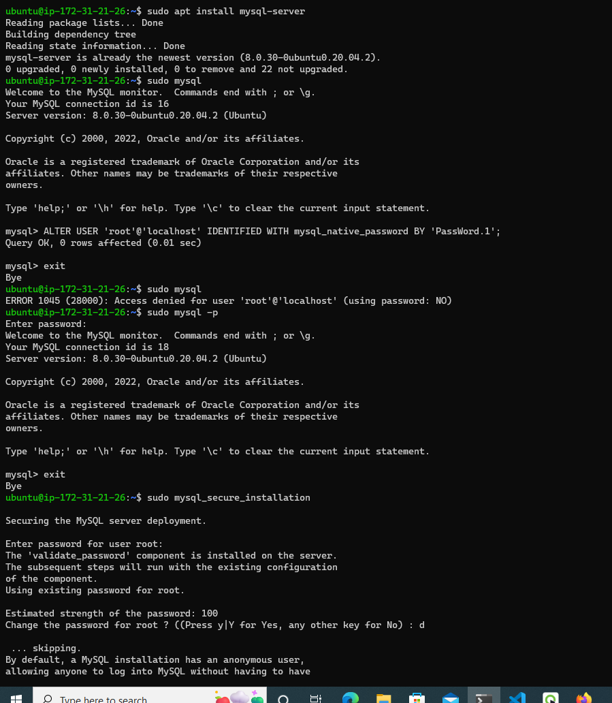

### **STEP 3: Installing PHP**

`sudo apt install php-fpm php-mysql`

`php -v`

result

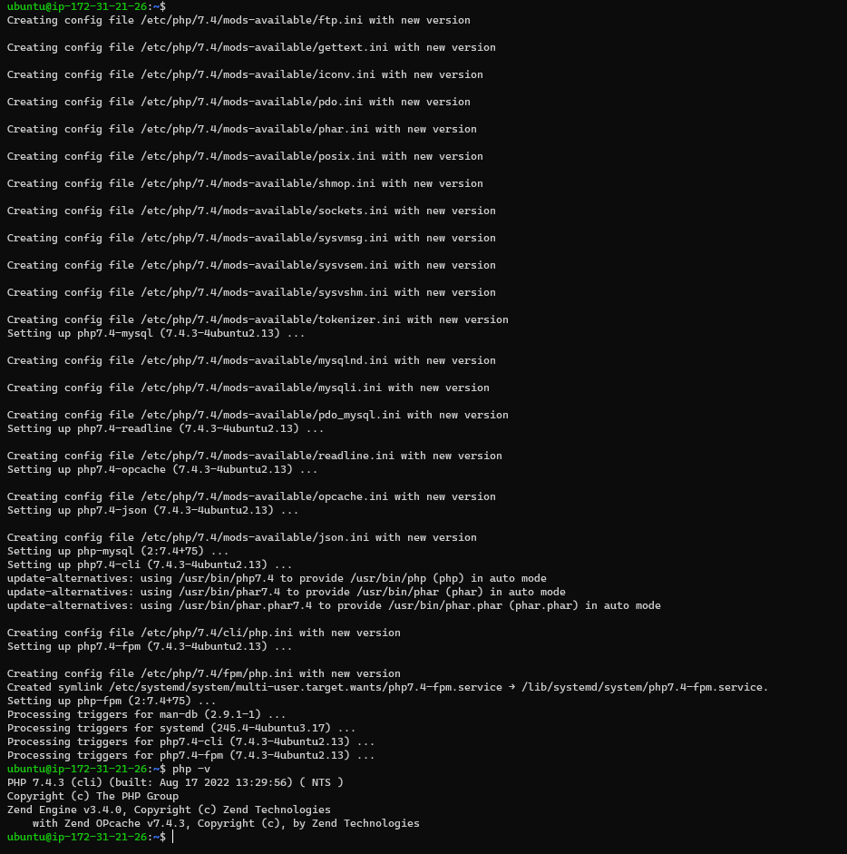

### **STEP 4: Configuring Nginx to Use PHP Processor**

When using the Nginx web server, we can create server blocks (similar to virtual hosts in Apache) to encapsulate configuration details and host more than one domain on a single server. In this guide, we will use projectLEMP as an example domain name

`sudo mkdir /var/www/projectLEMP`

`sudo chown -R $USER:$USER /var/www/projectLEMP`

`sudo vim /etc/nginx/sites-available/projectLEMP`

#/etc/nginx/sites-available/projectLEMP

server {
listen 80;
server_name projectLEMP www.projectLEMP;
root /var/www/projectLEMP;

    index index.html index.htm index.php;

    location / {
        try_files $uri $uri/ =404;
    }

    location ~ \.php$ {
        include snippets/fastcgi-php.conf;
        fastcgi_pass unix:/var/run/php/php8.1-fpm.sock;
     }

    location ~ /\.ht {
        deny all;
    }

}`

`sudo ln -s /etc/nginx/sites-available/projectLEMP /etc/nginx/sites-enabled/`

`sudo nginx -t`

`sudo unlink /etc/nginx/sites-enabled/default`

`sudo systemctl reload nginx`

`sudo echo 'Hello LEMP from hostname' $(curl -s http://169.254.169.254/latest/meta-data/public-hostname) 'with public IP' $(curl -s http://169.254.169.254/latest/meta-data/public-ipv4) > /var/www/projectLEMP/index.html`

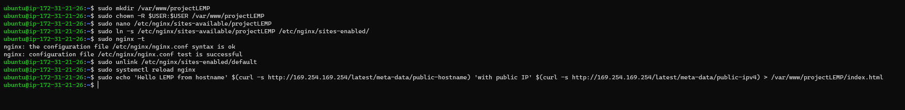

result:

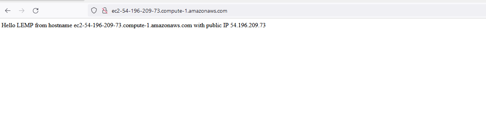

### **STEP 5: Testing PHP with Nginx**

`sudo vim /var/www/projectLEMP/info.php`

`<?php phpinfo();`

`http://`server_domain_or_IP`/info.php`

result:

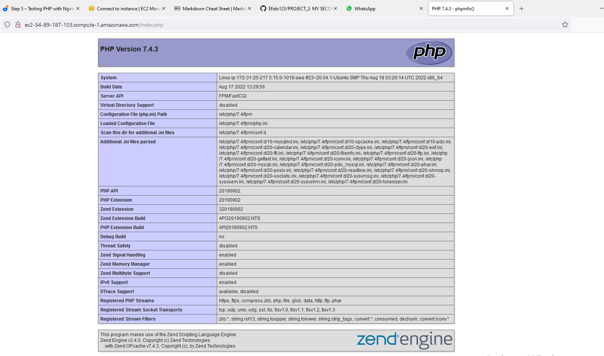

it’s best to remove the file you created as it contains sensitive information about your PHP environment and your Ubuntu server. You can use rm to remove that file:

`sudo rm /var/www/your_domain/info.php`

### **STEP 6: Retrieving data from MySQL database with PHP**

`sudo mysql`

`mysql> CREATE DATABASE `example_database`;`

`mysql> CREATE USER 'example_user'@'%' IDENTIFIED WITH mysql_native_password BY 'PassWord.1';`

`mysql> GRANT ALL ON example_database.* TO 'example_user'@'%';`

`mysql> exit`

`mysql -u example_user -p`

`mysql> SHOW DATABASES;`

result:

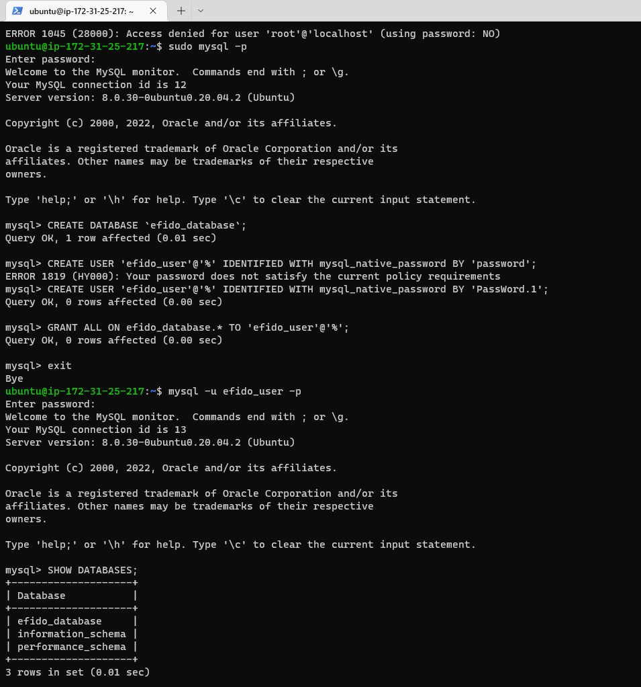

Next, we’ll create a test table named todo_list. From the MySQL console, run the following statement:

`CREATE TABLE example_database.todo_list (`

` item_id INT AUTO_INCREMENT,`

` content VARCHAR(255),`

` PRIMARY KEY(item_id)`

` );`

Insert a few rows of content in the test table. You might want to repeat the next command a few times, using different VALUES:

`mysql> INSERT INTO example_database.todo_list (content) VALUES ("My first important item");`

`mysql> SELECT * FROM example_database.todo_list;`

`mysql> exit`

Now you can create a PHP script that will connect to MySQL and query for your content. Create a new PHP file in your custom web root directory using your preferred editor. We’ll use vi for that:

`vim /var/www/projectLEMP/todo_list.php`

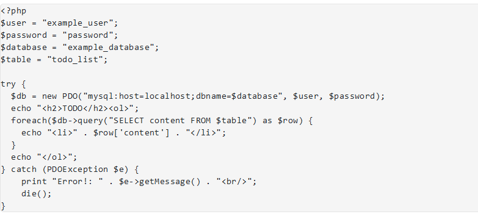

Then run:

`http://<Public_domain_or_IP>/todo_list.php`
on the browser

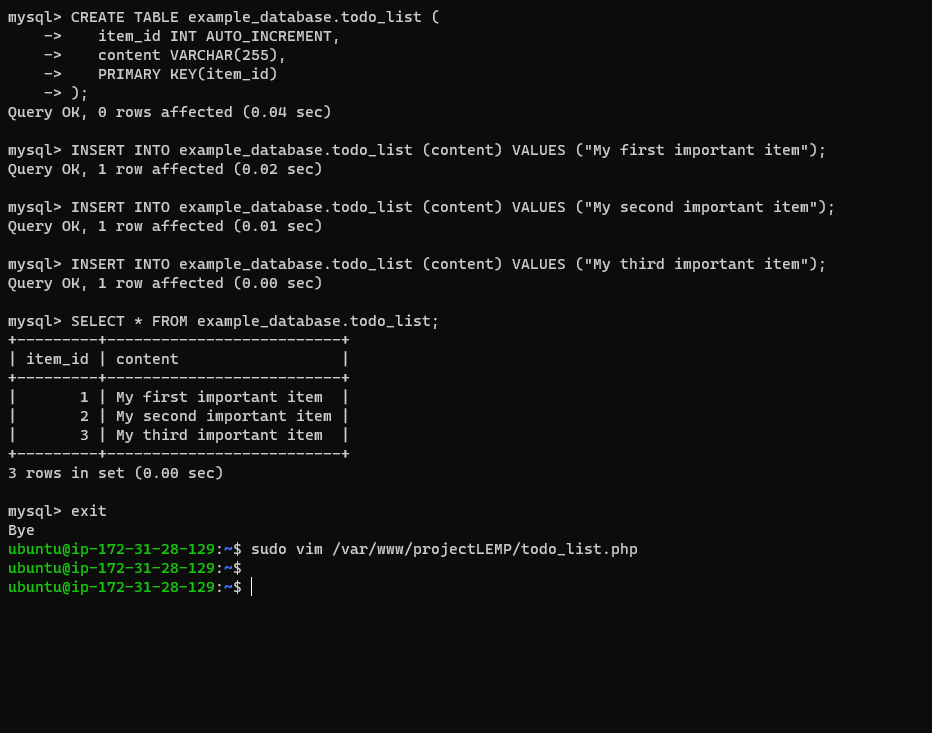

result:

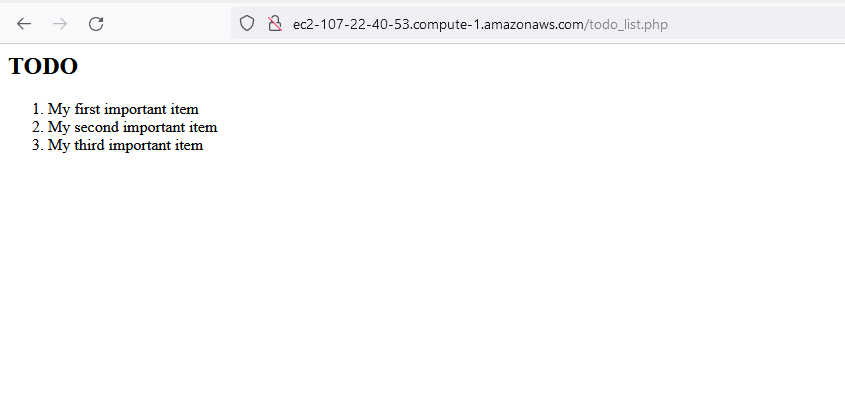
